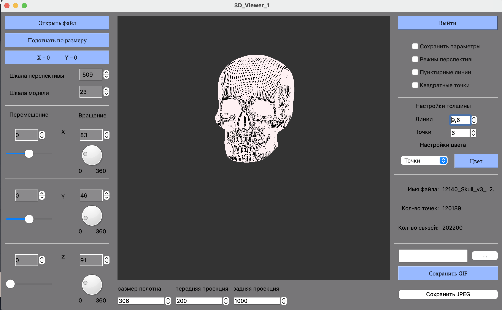
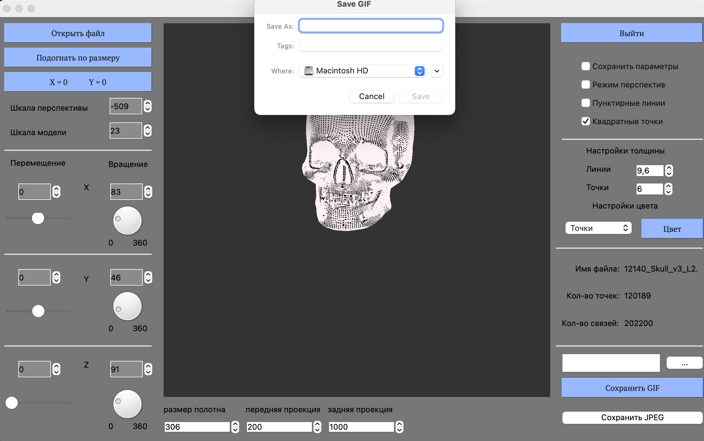

# 3D_Viewer - With interface for MacOS

## Install
1. `make install`
2. `make gcov_report` - start unit_test

## Unistall
1. make `uninstall`
2. make `clean`
---
## Description
В данном проекте мы с командой реализовывали отрисовку 3д объектов в формате `*.obj`.
В программе имеется функционал:
- отрисовка 3d обьектов

-  Создание и сохнарение Gif файлов

- изменение толщины, формы и цвета у точек соедений линий и самих линий
- изменение цвета заднего фона
- реалзованы афинные преоброзования(поворот объекта)
- прямая и парарельная проекция
- перемещение объекта
- подсчет количества точек и количества связей
- при закрытий приложения можно сохранить установленные параметры 